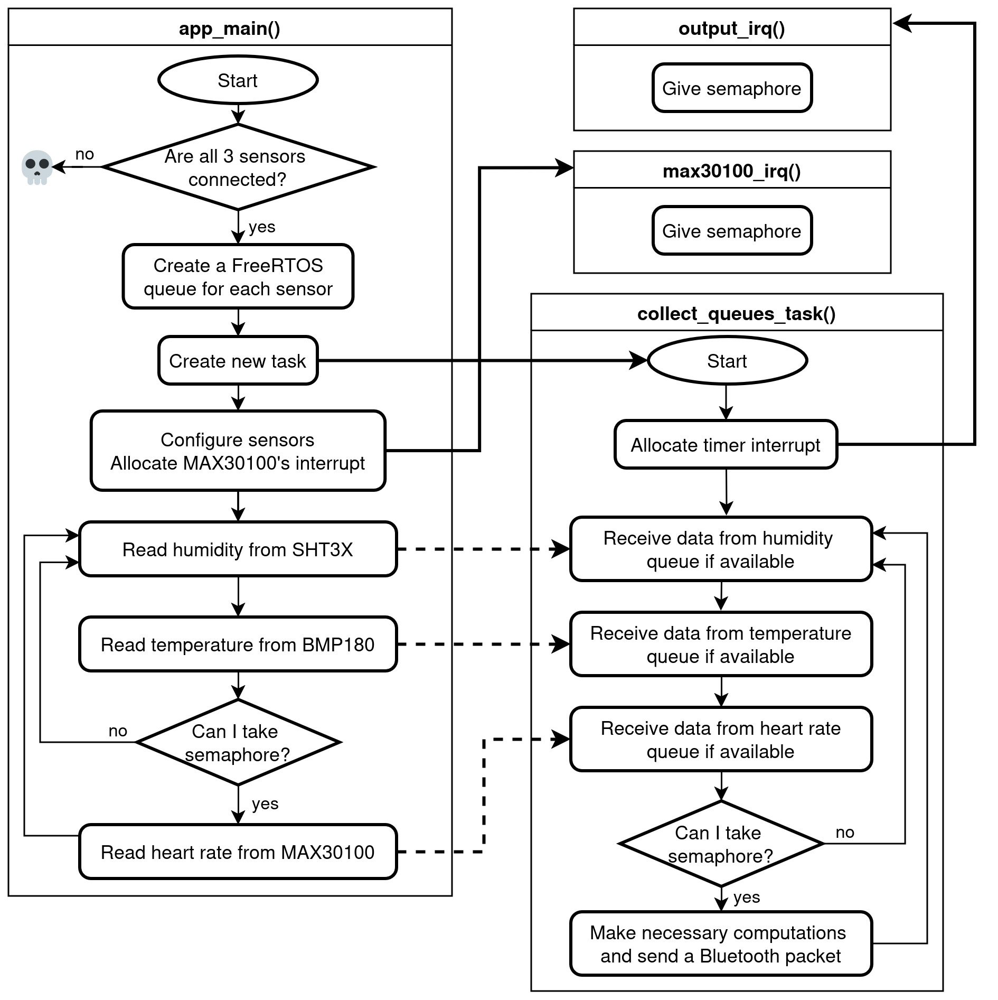

# Introduction

## Breadboard

For this assignment, I chose to develop firmware for an Espressif ESP32
microcontroller using its native development framework, ESP-IDF. My code
is written 100% in the C programming language, relying on ESP-IDF's
extensive API and FreeRTOS.
Figure [1](#fig:breadboard){reference-type="ref"
reference="fig:breadboard"} shows my breadboard circuit with the
microcontroller and three I2C sensors. The inner horizontal rails are
meant for delivering power, while the outer horizontal rails are for the
I2C bus. Thus, every sensor is connected with at least four wires: 3.3
V, ground, clock and data. Besides that, there are several other
connections. Resistors in the lower right corner are 3.9 $K\Omega$
pull-ups for the bus, the long black wire next to them connecting to a
sensor is for setting an address bit low, and a horizontally going
orange wire on the left is for connecting an interrupt pin of the
respective sensor.

{#fig:breadboard }

## Project structure

All code is located in the `main` directory, and CMakeLists.txt files
are required to build the project. To build and upload the code to
ESP32, I used `idf.py build` and `idf.py flash` commands, which are
parts of the ESP-IDF tools.

    .
    |-- CMakeLists.txt
    |-- main
    |   |-- ble.c
    |   |-- ble.h
    |   |-- CMakeLists.txt
    |   |-- config.h  <- can be edited to change pins and timings
    |   |-- filter.c
    |   |-- filter.h
    |   |-- i2c.c
    |   |-- i2c.h
    |   |-- main.c
    |   |-- queue.c
    |   |-- queue.h
    |-- report.pdf <- document you are reading

# Task 1: Designing and writing firmware

## Sensors chosen

Allow me to introduce the sensors, from left to right:

-   MAX30100, pulse oximetry and heart-rate sensor.
    Datasheet:
    <https://www.analog.com/media/en/technical-documentation/data-sheets/max30100.pdf>

-   BMP180, pressure sensor.
    Datasheet:
    <https://cdn-shop.adafruit.com/datasheets/BST-BMP180-DS000-09.pdf>

-   SHT3x-DIS, humidity and temperature sensor.
    Datasheet:
    <https://sensirion.com/media/documents/213E6A3B/63A5A569/Datasheet_SHT3x_DIS.pdf>

## I2C communication

All of the sensors have different addresses and two of them require
special configuration before they are able to function. `main/i2c.c`
contains functions such as:

-   `i2c_init()`, which initializes I2C bus and devices handles.

-   `sensors_configure()`, which configures BMP180 and MAX30100. BMP180
    sensor's EEPROM contains values required for pressure and
    temperature calculation, and are needed to be read before any
    measurement is performed. MAX30100's configuration is very
    complicated, because it has everything turned off by default. My
    options include enabling the heart rate only mode, setting the
    highest ADC resolution of 16 bits, setting maximum current for the
    infrared LED, setting sampling frequency of 50 Hz (minimal) and
    configuring the interrupt.

-   `sensors_read()`, which has an infinite loop that reads humidity
    from SHT3x-DIS, temperature from BMP180, and heart rate from
    MAX30100. SHT3x-DIS provides additional CRC bits which I check with
    `sht3x_crc(uint16_t data, uint8_t crc)` function. Temperature is
    calculated according to the algorithm written in the BMP180's
    datasheet. MAX30100 sensor is only read from if there is sampled
    data available, the presence of which is signaled by
    `max30100_irq()` through a semaphore. Interpreting signals from the
    heart rate sensor, however, is not an easy task and I just save the
    raw values.

## Moving median filter

Code with the filter and other mathematical functions is located in the
`main/filter.c` file. The function `filter_sensor_value()` applies a
moving median filter on all data inside an array. It calls internally
`find_median()`, a macro similar to `find_min()` and `find_max()`, which
call the generic `find_rank()` function. It runs in O(n) time given any
rank, way better than performing sorting on an array and taking the
middle element. The same file implements `find_stddev()`, the standard
deviation function.

## Circular buffer

My implementation does not really use the signature provided in the
assignment. That's because I used FreeRTOS's queue implementation to
pass samples from producer thread to consumer thread, that is
`xQueueSend()` and `xQueueReceive()`. In the file `main/queue.c`, there
is one function responsible for receiving samples and putting them into
circular buffers. The function also defines a timer, which triggers an
interrupt service routine every 30 seconds. After the ISR gives the
semaphore, data from the circular buffers is processed and packed into a
custom structure called `ble_packet_t`. As it is clear from the type
name, it is meant to be delivered to the Bluetooth task for further
transmission.

## Bluetooth

I did not implement the Bluetooth part because of the lack of time. The
file `main/ble.c` contains a function that just prints the contents of
the packet to the serial port, instead of transmitting it wirelessly. I
would have used *ESP-IDF Gatt Server Example* as a reference for this
task. I would have needed to define three services, each for one sensor.
I would have picked standard UUID numbers for temperature, humidity and
heart rate, so that any device is able to identify the type of data
advertised. Each service would have had four characterists: standard
deviation, max, min and median values, which most probably would have
used my proprietary UUIDs. On the client side, I could have used any BLE
scanner application to read through the services and their
characterists.

# Task 2: Bonus

## RTOS

My design of the firwmare implements two threads, as show in the
Figure [2](#fig:algorithm){reference-type="ref"
reference="fig:algorithm"}. `app_main` is the producer thread, and the
production takes place inside the `sensors_read()` function of
`main/i2c.c` file. `collect_queues_task()` of the file `main/queue.c` is
the consumer thread, created under FreeRTOS. The producer thread is
assigned a higher priority than the consumer thread.

I did not uses mutexes in inter-task communication, since FreeRTOS
provides thread-safe queues, with which I do not need to worry about the
race conditions. In my implementation, each time the producer thread
wants to send data, it can in theory wait forever until the data is
transmitted. However, the producer thread does not need to read the data
immediately; rather, it is buffered in the above mentioned queues. With
enough space allocated to the queues, the producer thread will never
block.

In the case when the consumer thread is too slow or not functioning at
all, the producer thread will eventually block, because the queue cannot
receive any new data. It happened to me when I had not still implemented
the consumer side properly: the program worked until the queues became
full. Even though the main thread has a higher priority, it calls delays
to match the required sampling rate, so that the starvation of
`collect_queues_task()` and situations when queues become full are
impossible.

{#fig:algorithm}

# Demo

Tables down here are unaltered outputs recorded from the
microcontroller, using `idf.py monitor`.

After keeping the board for a minute in fridge, temperature is low:

    |             Name |           Stddev |              Max |              Min |           Median |
    +------------------+------------------+------------------+------------------+------------------+
    |      Temperature |         0.040000 |        18.600000 |        18.500000 |        18.500000 |
    |         Humidity |         0.026194 |        80.563057 |        80.476082 |        80.543221 |
    |       Heart rate |         4.882622 |        20.000000 |         4.000000 |        12.000000 |

After breathing warm air on sensors, both temperature and humidity rise:

    |             Name |           Stddev |              Max |              Min |           Median |
    +------------------+------------------+------------------+------------------+------------------+
    |      Temperature |         0.404969 |        28.900000 |        27.700001 |        28.400000 |
    |         Humidity |         0.208927 |        92.593269 |        91.914246 |        92.314034 |
    |       Heart rate |       974.022217 |      2604.000000 |         0.000000 |      2396.000000 |

After leaving at regular room conditions, temperature and humidity get
normal values:

    |             Name |           Stddev |              Max |              Min |           Median |
    +------------------+------------------+------------------+------------------+------------------+
    |      Temperature |         0.045825 |        25.799999 |        25.700001 |        25.799999 |
    |         Humidity |         0.018065 |        57.746243 |        57.682156 |        57.709621 |
    |       Heart rate |         6.311894 |        72.000000 |        48.000000 |        60.000000 |

After putting a finger on the heart rate sensor, I can confirm that I am
alive but it is impossible to tell my heart rate just from the raw
values:

    |             Name |           Stddev |              Max |              Min |           Median |
    +------------------+------------------+------------------+------------------+------------------+
    |      Temperature |         0.000000 |        25.700001 |        25.700001 |        25.700001 |
    |         Humidity |         0.055461 |        62.835125 |        62.652020 |        62.740520 |
    |       Heart rate |     19462.945312 |     51200.000000 |       161.000000 |     41540.000000 |
